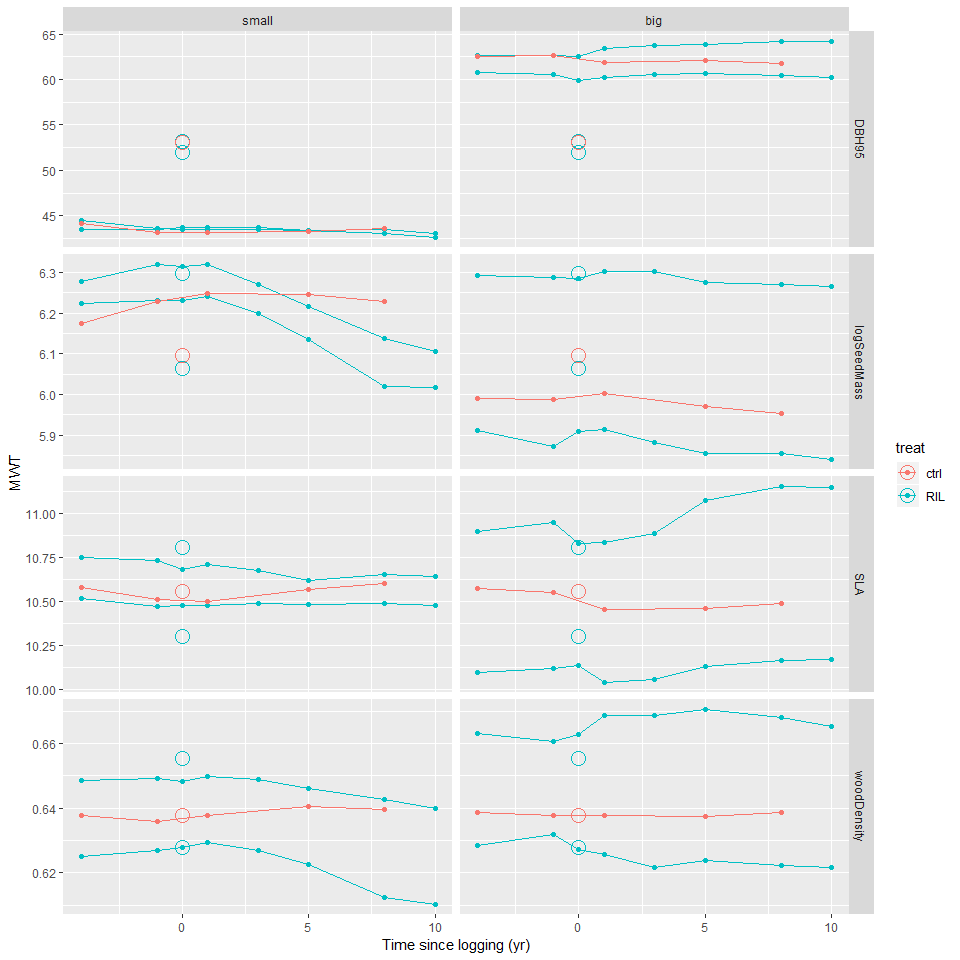
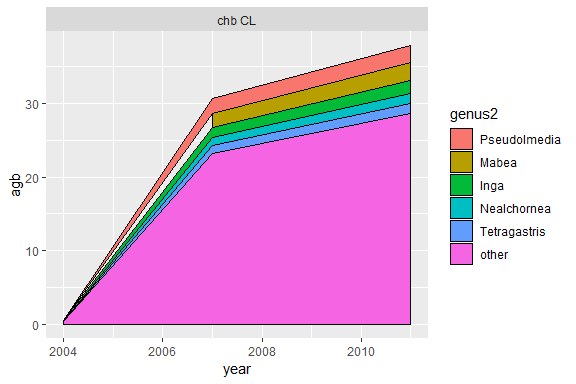
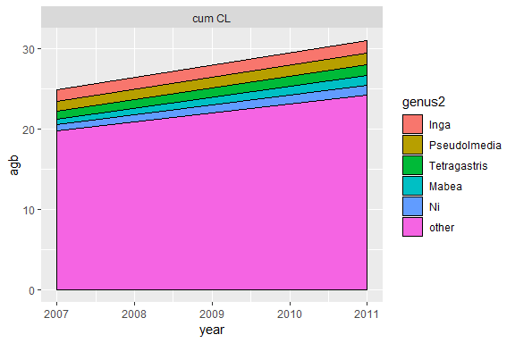
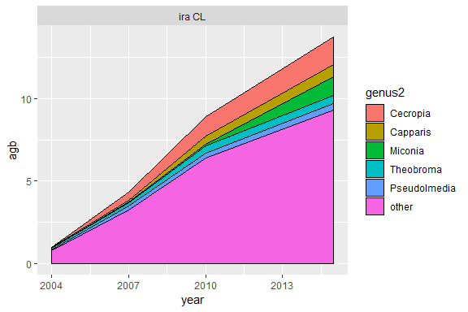
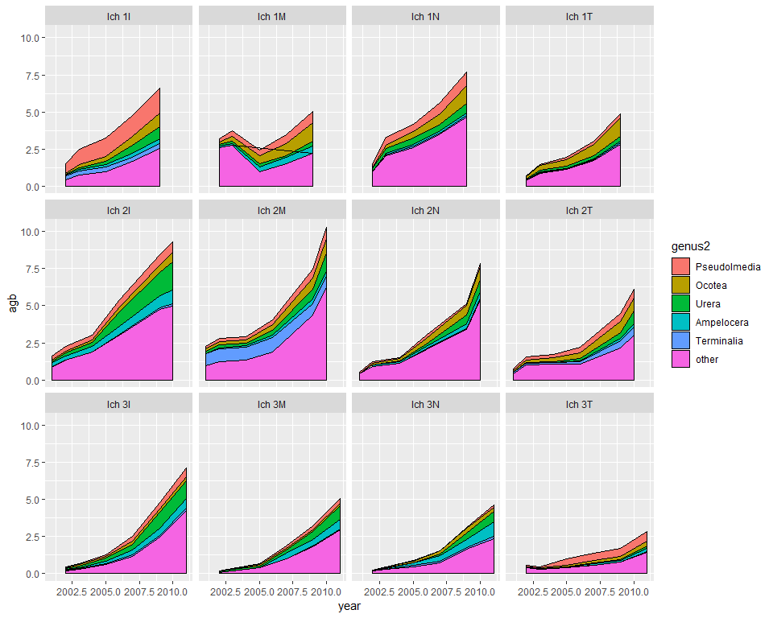

In this study we model the functional resistance and resilience of trees recruitement to disturbance (here selective logging), and their spatial variation in Amazonia. 

# Data visualisation

## Traits trajectory {.tabset .tabset-fade .tabset-pills}

Traits chosen: 

- $DBH95$: DBH 95th percentile (per species) as a proxy of the stature

- $logSeedMass$: median seed mass (log-transformed) as a proxy of the dispersal strategy

- $SLA$: median specific leaf area, as a proxy of the assimilation strategy and leaf economic spectrum

- $WD$: median wood density, as a proxy of growth rate and mechanical support

Cohorts: 

- Survivors, ie trees that survived logging

- Recruits, ie trees that passed the 10 cm DBH threshold after logging

Here are represented for each cohort the mean trait value, weighted by the estimated above ground biomass (AGB) of each individual.

### Jenaro 
<!-- -->

### Chico Bocao 
<!-- -->

### Cumaru 
<!-- -->

### INPA 
<!-- -->

### Iracema 
<!-- -->

### La Chonta 
<!-- -->

### Peteco 
<!-- -->

### Paracou 
<!-- -->

### Paragominas 
<!-- -->

### Tabocal 
<!-- -->

### Tapajos 
<!-- -->

### Tortue 
<!-- -->

## Recruits most common genuses and their impact on mean weighted traits {.tabset .tabset-pills}

### AGB per genus

genus2: genuses with > 10% of the recruits biomass

### Jenaro 
<!-- -->

### Chico Bocao 
<!-- -->

### Cumaru 
<!-- -->

### INPA 
<!-- -->

### Iracema 
<!-- -->

### La Chonta 
<!-- -->

### Peteco 
<!-- -->

### Paracou 
<!-- -->

### Paragominas 
<!-- -->

### Tabocal 
<!-- -->

### Tapajos 
<!-- -->

### Tortue 
<!-- -->

