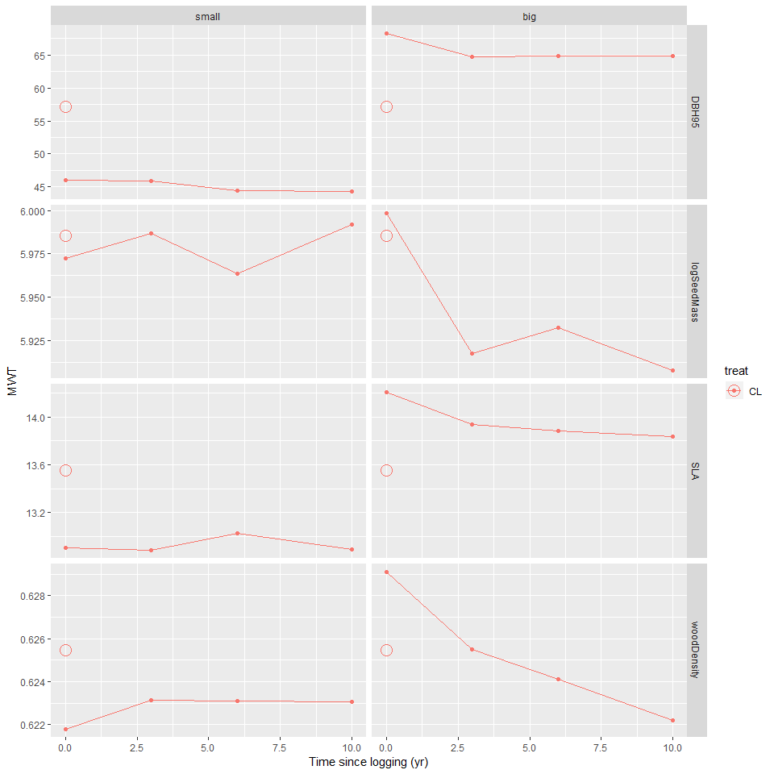
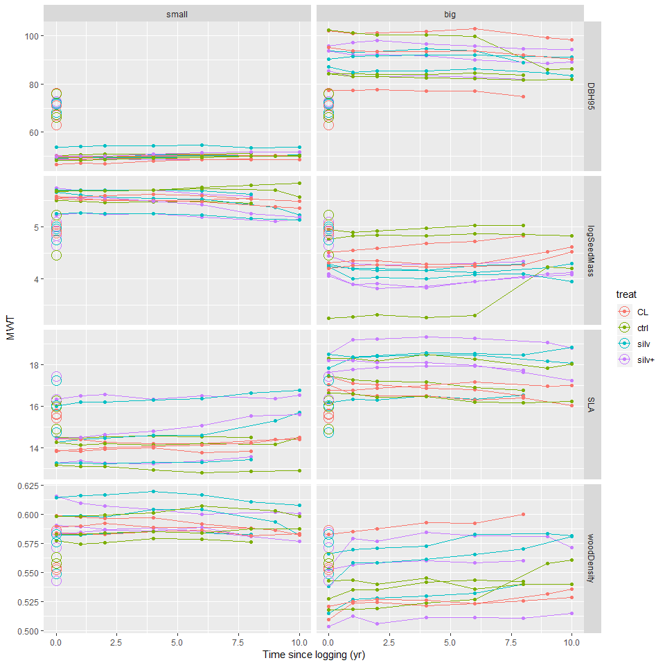
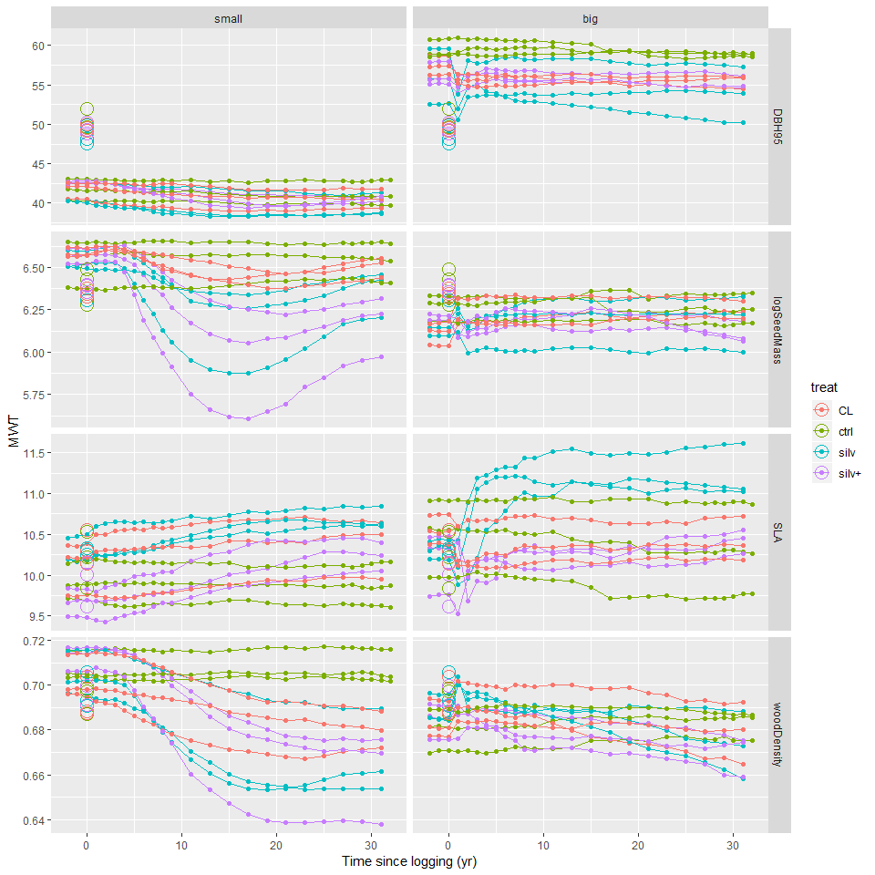
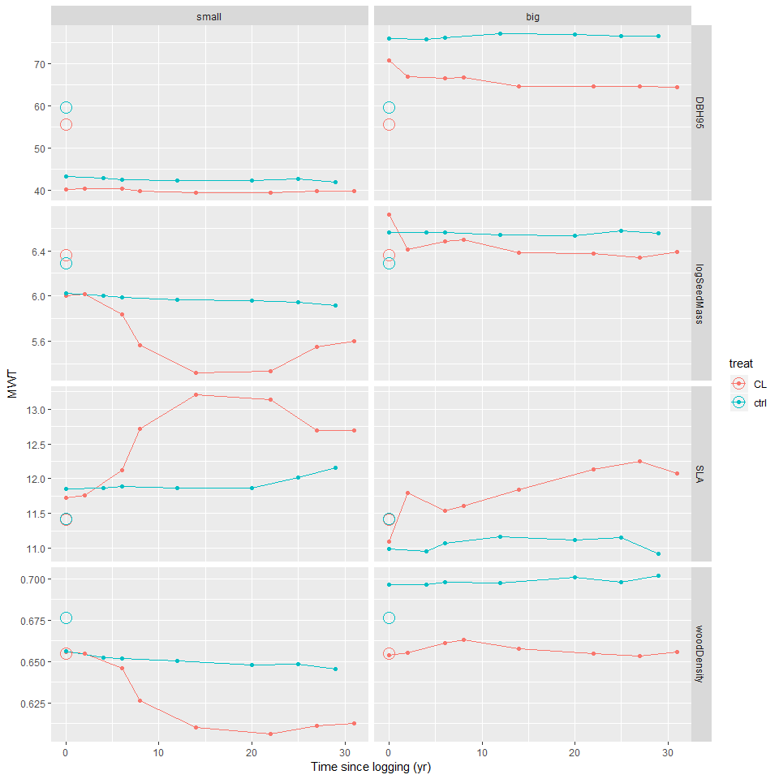
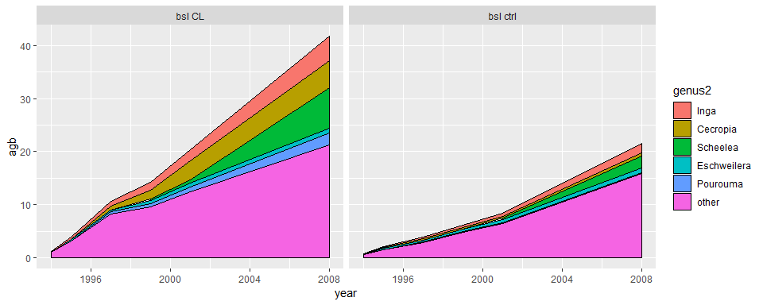
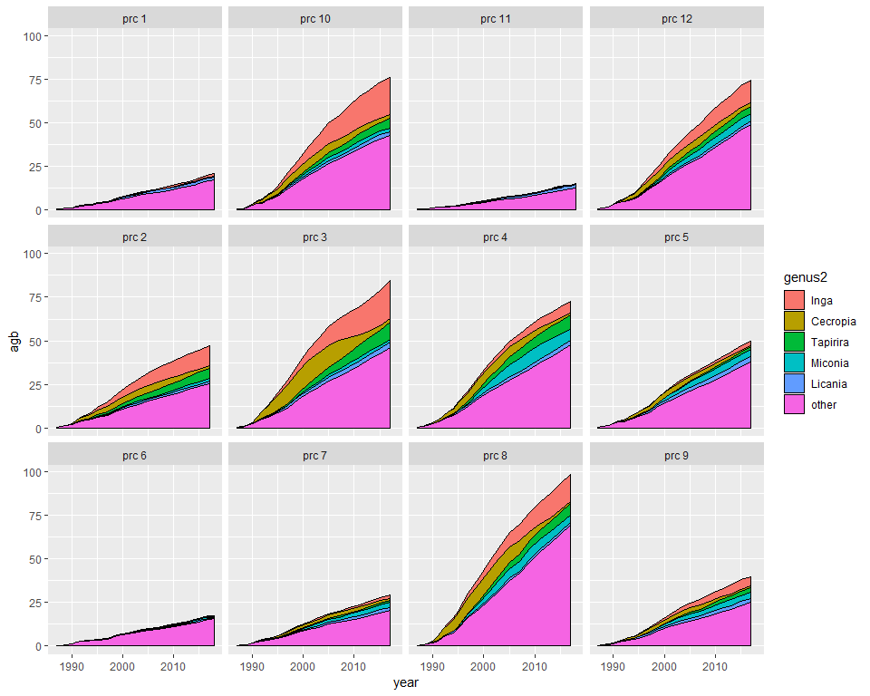
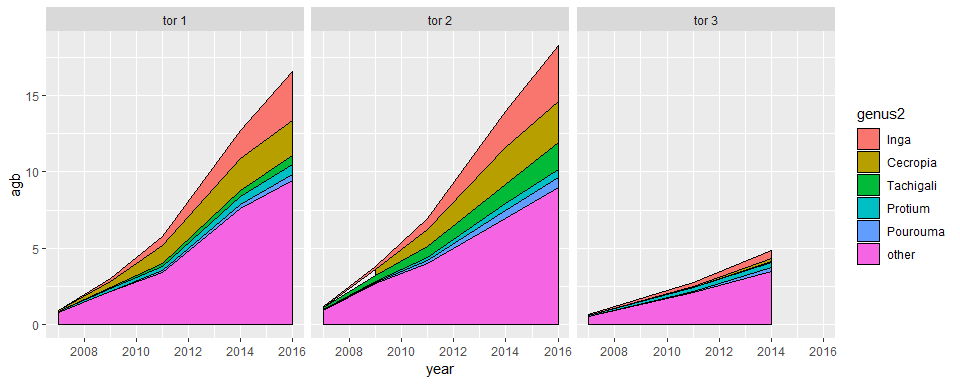

In this study we model the functional resistance and resilience of trees recruitement to disturbance (here selective logging), and their spatial variation in Amazonia. 

# Data visualisation

## by cohort

## Traits trajectory {.tabset .tabset-fade .tabset-pills}

Traits chosen: 

- $DBH95$: DBH 95th percentile (per species) as a proxy of the stature

- $logSeedMass$: median seed mass (log-transformed) as a proxy of the dispersal strategy

- $SLA$: median specific leaf area, as a proxy of the assimilation strategy and leaf economic spectrum

- $WD$: median wood density, as a proxy of growth rate and mechanical support

We separate two size classes: 

- Small trees, ie trees $\leq$ 35 cm dbh

- Big trees, ie trees $>$ 35 cm dbh

Here are represented for each size class the mean trait value, weighted by the estimated above ground biomass (AGB) of each individual.

### Jenaro 
<!-- -->

### Chico Bocao 
<!-- -->

### Cumaru 
<!-- -->

### INPA 
<!-- -->

### Iracema 
<!-- -->

### La Chonta 
<!-- -->

### Peteco 
<!-- -->

### Paracou 
<!-- -->

### Paragominas 
<!-- -->

### Tabocal 
<!-- -->

### Tapajos 
<!-- -->

### Tortue 
<!-- -->

## Recruits most common genuses and their impact on mean weighted traits {.tabset .tabset-pills}

genus2: genuses with > 10% of the recruits biomass

### Jenaro 
<!-- -->

### Chico Bocao 
<!-- -->

### Cumaru 
<!-- -->

### INPA 
<!-- -->

### Iracema 
<!-- -->

### La Chonta 
<!-- -->

### Peteco 
<!-- -->

### Paracou 
<!-- -->

### Paragominas 
<!-- -->

### Tabocal 
<!-- -->

### Tapajos 
<!-- -->

### Tortue 
<!-- -->

# Calibrating the stan model

For each trait $k$, the mean biomass-weighted trait of small trees (MWT) trajectory at census $c$ in plot $p$ in site $s$ was modelled as:

$$  dT_{k,c,p,s} = \frac{T_{k,c,p,s} - T0_{k,p,s}}{T0_{k,p,s}} \sim \mathcal{N}\left( \mu_{k,c,p,s}\text{ , } \left(\frac{\sigma_k}{size_p}\right)^2\right)$$

with 

$$ \mu_{k,c,p,s} = \left(\Delta_{k,p,s} \cdot  \frac{t_c}{tmax_{k,p,s}} \cdot exp\left(1-\frac{t_c}{tmax_{k,p,s}}\right)\right)^{\theta_{k,p,s}} $$

- $c$ the census, and $t_c$ the time since logging (in years) at census $c$, 

- $T0_{k,p,s}$ the pre-logging trait value of the community in plot $p$ in site $s$.

- $\Delta_{k,p,s}$ is the maximum value (relative to the final value) of the hump that follows logging and the creation of logging gaps. $\Delta_{k,p,s} \sim \mathcal{N} (\mu_{\Delta ks}, \sigma_{\Delta}^2)$, with $\mu_{\Delta ks}$ and $\sigma_{\Delta}$ are respectively the mean and standard deviation of $\Delta$ for trait $k$ in site $s$.

- $tmax_{k,p,s}$ is the time when the maximum value of the hump is reached. $tmax_{k,p} = 0$ for control plots and in logged plots $tmax_{k,p} \sim \mathcal{N} (\mu m_{ k}, \sigma m^2)$ where $\mu m_{k}$ and $\sigma m$ are respectively the mean and standard deviation of $tmax$ for trait $k$.

- $\theta_k$ is a shape parameter that controls the width of the hump; when it increases, the hump is narrower.  

- $size_p$ is the size of plot $p$

## Parameters {.tabset .tabset-pills}
(check parameters correlation)

### Delta
<!-- -->

### tmax
<!-- -->

### theta
<!-- -->

### theta vs tmax
<!-- -->

### Delta vs tmax
<!-- -->

### theta vs Delta
<!-- -->

## Predictions {.tabset .tabset-pills}

### Jenaro 
<!-- -->

### Chico Bocao 
<!-- -->

### Cumaru 
<!-- -->

### INPA 
<!-- -->

### Iracema 
<!-- -->

### La Chonta 
<!-- -->

### Peteco 
<!-- -->

### Paracou 
<!-- -->

### Paragominas 
<!-- -->

### Tabocal 
<!-- -->

### Tapajos 
<!-- -->

### Tortue 
<!-- -->

# Adding covariates to the model

## Model 

$$ \Delta_{p,k} = loss \cdot (\lambda_0 + \sum \lambda_m Cov_{m,p}) $$
Covariates are centered and scaled. 

## Linear model variable selection {.tabset .tabset-pills}

### DBH95

<table style="border-collapse:collapse; border:none;">
<tr>
<th style="border-top: double; text-align:center; font-style:normal; font-weight:bold; padding:0.2cm;  text-align:left; ">&nbsp;</th>
<th colspan="3" style="border-top: double; text-align:center; font-style:normal; font-weight:bold; padding:0.2cm; ">mean</th>
</tr>
<tr>
<td style=" text-align:center; border-bottom:1px solid; font-style:italic; font-weight:normal;  text-align:left; ">Predictors</td>
<td style=" text-align:center; border-bottom:1px solid; font-style:italic; font-weight:normal;  ">Estimates</td>
<td style=" text-align:center; border-bottom:1px solid; font-style:italic; font-weight:normal;  ">CI</td>
<td style=" text-align:center; border-bottom:1px solid; font-style:italic; font-weight:normal;  ">p</td>
</tr>
<tr>
<td style=" padding:0.2cm; text-align:left; vertical-align:top; text-align:left; ">loss rel</td>
<td style=" padding:0.2cm; text-align:left; vertical-align:top; text-align:center;  ">-0.32</td>
<td style=" padding:0.2cm; text-align:left; vertical-align:top; text-align:center;  ">-0.44&nbsp;&ndash;&nbsp;-0.19</td>
<td style=" padding:0.2cm; text-align:left; vertical-align:top; text-align:center;  "><strong>&lt;0.001</td>
</tr>
<tr>
<td style=" padding:0.2cm; text-align:left; vertical-align:top; text-align:left; ">loss_rel:prec_sc</td>
<td style=" padding:0.2cm; text-align:left; vertical-align:top; text-align:center;  ">5.20</td>
<td style=" padding:0.2cm; text-align:left; vertical-align:top; text-align:center;  ">2.27&nbsp;&ndash;&nbsp;8.12</td>
<td style=" padding:0.2cm; text-align:left; vertical-align:top; text-align:center;  "><strong>0.002</strong></td>
</tr>
<tr>
<td style=" padding:0.2cm; text-align:left; vertical-align:top; text-align:left; ">loss_rel:seas_sc</td>
<td style=" padding:0.2cm; text-align:left; vertical-align:top; text-align:center;  ">-4.95</td>
<td style=" padding:0.2cm; text-align:left; vertical-align:top; text-align:center;  ">-7.90&nbsp;&ndash;&nbsp;-2.00</td>
<td style=" padding:0.2cm; text-align:left; vertical-align:top; text-align:center;  "><strong>0.003</strong></td>
</tr>
<tr>
<td style=" padding:0.2cm; text-align:left; vertical-align:top; text-align:left; ">loss_rel:dry_sc</td>
<td style=" padding:0.2cm; text-align:left; vertical-align:top; text-align:center;  ">-4.34</td>
<td style=" padding:0.2cm; text-align:left; vertical-align:top; text-align:center;  ">-6.86&nbsp;&ndash;&nbsp;-1.82</td>
<td style=" padding:0.2cm; text-align:left; vertical-align:top; text-align:center;  "><strong>0.002</strong></td>
</tr>
<tr>
<td style=" padding:0.2cm; text-align:left; vertical-align:top; text-align:left; ">loss_rel:cwd_sc</td>
<td style=" padding:0.2cm; text-align:left; vertical-align:top; text-align:center;  ">-5.69</td>
<td style=" padding:0.2cm; text-align:left; vertical-align:top; text-align:center;  ">-8.83&nbsp;&ndash;&nbsp;-2.55</td>
<td style=" padding:0.2cm; text-align:left; vertical-align:top; text-align:center;  "><strong>0.002</strong></td>
</tr>
<tr>
<td style=" padding:0.2cm; text-align:left; vertical-align:top; text-align:left; ">loss_rel:Depth_sc</td>
<td style=" padding:0.2cm; text-align:left; vertical-align:top; text-align:center;  ">-1.09</td>
<td style=" padding:0.2cm; text-align:left; vertical-align:top; text-align:center;  ">-1.67&nbsp;&ndash;&nbsp;-0.51</td>
<td style=" padding:0.2cm; text-align:left; vertical-align:top; text-align:center;  "><strong>0.001</strong></td>
</tr>
<tr>
<td style=" padding:0.2cm; text-align:left; vertical-align:top; text-align:left; ">loss_rel:Psand_sc</td>
<td style=" padding:0.2cm; text-align:left; vertical-align:top; text-align:center;  ">-1.45</td>
<td style=" padding:0.2cm; text-align:left; vertical-align:top; text-align:center;  ">-2.38&nbsp;&ndash;&nbsp;-0.52</td>
<td style=" padding:0.2cm; text-align:left; vertical-align:top; text-align:center;  "><strong>0.005</strong></td>
</tr>
<tr>
<td style=" padding:0.2cm; text-align:left; vertical-align:top; text-align:left; ">loss_rel:CEC_sc</td>
<td style=" padding:0.2cm; text-align:left; vertical-align:top; text-align:center;  ">-0.57</td>
<td style=" padding:0.2cm; text-align:left; vertical-align:top; text-align:center;  ">-0.97&nbsp;&ndash;&nbsp;-0.18</td>
<td style=" padding:0.2cm; text-align:left; vertical-align:top; text-align:center;  "><strong>0.009</strong></td>
</tr>
<tr>
<td style=" padding:0.2cm; text-align:left; vertical-align:top; text-align:left; ">loss_rel:CFr_sc</td>
<td style=" padding:0.2cm; text-align:left; vertical-align:top; text-align:center;  ">-2.58</td>
<td style=" padding:0.2cm; text-align:left; vertical-align:top; text-align:center;  ">-4.01&nbsp;&ndash;&nbsp;-1.14</td>
<td style=" padding:0.2cm; text-align:left; vertical-align:top; text-align:center;  "><strong>0.002</strong></td>
</tr>
<tr>
<td style=" padding:0.2cm; text-align:left; vertical-align:top; text-align:left; ">loss_rel:smort_sc</td>
<td style=" padding:0.2cm; text-align:left; vertical-align:top; text-align:center;  ">-2.85</td>
<td style=" padding:0.2cm; text-align:left; vertical-align:top; text-align:center;  ">-4.37&nbsp;&ndash;&nbsp;-1.33</td>
<td style=" padding:0.2cm; text-align:left; vertical-align:top; text-align:center;  "><strong>0.001</strong></td>
</tr>
<tr>
<td style=" padding:0.2cm; text-align:left; vertical-align:top; text-align:left; padding-top:0.1cm; padding-bottom:0.1cm; border-top:1px solid;">Observations</td>
<td style=" padding:0.2cm; text-align:left; vertical-align:top; padding-top:0.1cm; padding-bottom:0.1cm; text-align:left; border-top:1px solid;" colspan="3">35</td>
</tr>
<tr>
<td style=" padding:0.2cm; text-align:left; vertical-align:top; text-align:left; padding-top:0.1cm; padding-bottom:0.1cm;">R2 / adjusted R2</td>
<td style=" padding:0.2cm; text-align:left; vertical-align:top; padding-top:0.1cm; padding-bottom:0.1cm; text-align:left;" colspan="3">0.913 / 0.879</td>
</tr>

</table>

### SLA

<table style="border-collapse:collapse; border:none;">
<tr>
<th style="border-top: double; text-align:center; font-style:normal; font-weight:bold; padding:0.2cm;  text-align:left; ">&nbsp;</th>
<th colspan="3" style="border-top: double; text-align:center; font-style:normal; font-weight:bold; padding:0.2cm; ">mean</th>
</tr>
<tr>
<td style=" text-align:center; border-bottom:1px solid; font-style:italic; font-weight:normal;  text-align:left; ">Predictors</td>
<td style=" text-align:center; border-bottom:1px solid; font-style:italic; font-weight:normal;  ">Estimates</td>
<td style=" text-align:center; border-bottom:1px solid; font-style:italic; font-weight:normal;  ">CI</td>
<td style=" text-align:center; border-bottom:1px solid; font-style:italic; font-weight:normal;  ">p</td>
</tr>
<tr>
<td style=" padding:0.2cm; text-align:left; vertical-align:top; text-align:left; ">loss rel</td>
<td style=" padding:0.2cm; text-align:left; vertical-align:top; text-align:center;  ">0.12</td>
<td style=" padding:0.2cm; text-align:left; vertical-align:top; text-align:center;  ">-0.03&nbsp;&ndash;&nbsp;0.27</td>
<td style=" padding:0.2cm; text-align:left; vertical-align:top; text-align:center;  ">0.134</td>
</tr>
<tr>
<td style=" padding:0.2cm; text-align:left; vertical-align:top; text-align:left; ">loss_rel:seas_sc</td>
<td style=" padding:0.2cm; text-align:left; vertical-align:top; text-align:center;  ">0.91</td>
<td style=" padding:0.2cm; text-align:left; vertical-align:top; text-align:center;  ">0.47&nbsp;&ndash;&nbsp;1.35</td>
<td style=" padding:0.2cm; text-align:left; vertical-align:top; text-align:center;  "><strong>&lt;0.001</td>
</tr>
<tr>
<td style=" padding:0.2cm; text-align:left; vertical-align:top; text-align:left; ">loss_rel:cwd_sc</td>
<td style=" padding:0.2cm; text-align:left; vertical-align:top; text-align:center;  ">0.63</td>
<td style=" padding:0.2cm; text-align:left; vertical-align:top; text-align:center;  ">0.29&nbsp;&ndash;&nbsp;0.97</td>
<td style=" padding:0.2cm; text-align:left; vertical-align:top; text-align:center;  "><strong>0.001</strong></td>
</tr>
<tr>
<td style=" padding:0.2cm; text-align:left; vertical-align:top; text-align:left; ">loss_rel:Depth_sc</td>
<td style=" padding:0.2cm; text-align:left; vertical-align:top; text-align:center;  ">-0.27</td>
<td style=" padding:0.2cm; text-align:left; vertical-align:top; text-align:center;  ">-0.50&nbsp;&ndash;&nbsp;-0.03</td>
<td style=" padding:0.2cm; text-align:left; vertical-align:top; text-align:center;  "><strong>0.039</strong></td>
</tr>
<tr>
<td style=" padding:0.2cm; text-align:left; vertical-align:top; text-align:left; ">loss_rel:Psand_sc</td>
<td style=" padding:0.2cm; text-align:left; vertical-align:top; text-align:center;  ">0.41</td>
<td style=" padding:0.2cm; text-align:left; vertical-align:top; text-align:center;  ">0.13&nbsp;&ndash;&nbsp;0.68</td>
<td style=" padding:0.2cm; text-align:left; vertical-align:top; text-align:center;  "><strong>0.007</strong></td>
</tr>
<tr>
<td style=" padding:0.2cm; text-align:left; vertical-align:top; text-align:left; ">loss_rel:CEC_sc</td>
<td style=" padding:0.2cm; text-align:left; vertical-align:top; text-align:center;  ">0.53</td>
<td style=" padding:0.2cm; text-align:left; vertical-align:top; text-align:center;  ">0.29&nbsp;&ndash;&nbsp;0.77</td>
<td style=" padding:0.2cm; text-align:left; vertical-align:top; text-align:center;  "><strong>&lt;0.001</td>
</tr>
<tr>
<td style=" padding:0.2cm; text-align:left; vertical-align:top; text-align:left; ">loss_rel:BkD_sc</td>
<td style=" padding:0.2cm; text-align:left; vertical-align:top; text-align:center;  ">0.40</td>
<td style=" padding:0.2cm; text-align:left; vertical-align:top; text-align:center;  ">0.06&nbsp;&ndash;&nbsp;0.73</td>
<td style=" padding:0.2cm; text-align:left; vertical-align:top; text-align:center;  "><strong>0.027</strong></td>
</tr>
<tr>
<td style=" padding:0.2cm; text-align:left; vertical-align:top; text-align:left; ">loss_rel:CFr_sc</td>
<td style=" padding:0.2cm; text-align:left; vertical-align:top; text-align:center;  ">0.25</td>
<td style=" padding:0.2cm; text-align:left; vertical-align:top; text-align:center;  ">-0.03&nbsp;&ndash;&nbsp;0.54</td>
<td style=" padding:0.2cm; text-align:left; vertical-align:top; text-align:center;  ">0.093</td>
</tr>
<tr>
<td style=" padding:0.2cm; text-align:left; vertical-align:top; text-align:left; padding-top:0.1cm; padding-bottom:0.1cm; border-top:1px solid;">Observations</td>
<td style=" padding:0.2cm; text-align:left; vertical-align:top; padding-top:0.1cm; padding-bottom:0.1cm; text-align:left; border-top:1px solid;" colspan="3">35</td>
</tr>
<tr>
<td style=" padding:0.2cm; text-align:left; vertical-align:top; text-align:left; padding-top:0.1cm; padding-bottom:0.1cm;">R2 / adjusted R2</td>
<td style=" padding:0.2cm; text-align:left; vertical-align:top; padding-top:0.1cm; padding-bottom:0.1cm; text-align:left;" colspan="3">0.844 / 0.798</td>
</tr>

</table>

### logSeedMass

<table style="border-collapse:collapse; border:none;">
<tr>
<th style="border-top: double; text-align:center; font-style:normal; font-weight:bold; padding:0.2cm;  text-align:left; ">&nbsp;</th>
<th colspan="3" style="border-top: double; text-align:center; font-style:normal; font-weight:bold; padding:0.2cm; ">mean</th>
</tr>
<tr>
<td style=" text-align:center; border-bottom:1px solid; font-style:italic; font-weight:normal;  text-align:left; ">Predictors</td>
<td style=" text-align:center; border-bottom:1px solid; font-style:italic; font-weight:normal;  ">Estimates</td>
<td style=" text-align:center; border-bottom:1px solid; font-style:italic; font-weight:normal;  ">CI</td>
<td style=" text-align:center; border-bottom:1px solid; font-style:italic; font-weight:normal;  ">p</td>
</tr>
<tr>
<td style=" padding:0.2cm; text-align:left; vertical-align:top; text-align:left; ">loss rel</td>
<td style=" padding:0.2cm; text-align:left; vertical-align:top; text-align:center;  ">-0.16</td>
<td style=" padding:0.2cm; text-align:left; vertical-align:top; text-align:center;  ">-0.25&nbsp;&ndash;&nbsp;-0.07</td>
<td style=" padding:0.2cm; text-align:left; vertical-align:top; text-align:center;  "><strong>0.002</strong></td>
</tr>
<tr>
<td style=" padding:0.2cm; text-align:left; vertical-align:top; text-align:left; ">loss_rel:prec_sc</td>
<td style=" padding:0.2cm; text-align:left; vertical-align:top; text-align:center;  ">0.19</td>
<td style=" padding:0.2cm; text-align:left; vertical-align:top; text-align:center;  ">0.05&nbsp;&ndash;&nbsp;0.33</td>
<td style=" padding:0.2cm; text-align:left; vertical-align:top; text-align:center;  "><strong>0.015</strong></td>
</tr>
<tr>
<td style=" padding:0.2cm; text-align:left; vertical-align:top; text-align:left; ">loss_rel:rad_sc</td>
<td style=" padding:0.2cm; text-align:left; vertical-align:top; text-align:center;  ">0.37</td>
<td style=" padding:0.2cm; text-align:left; vertical-align:top; text-align:center;  ">0.04&nbsp;&ndash;&nbsp;0.70</td>
<td style=" padding:0.2cm; text-align:left; vertical-align:top; text-align:center;  "><strong>0.036</strong></td>
</tr>
<tr>
<td style=" padding:0.2cm; text-align:left; vertical-align:top; text-align:left; ">loss_rel:CFr_sc</td>
<td style=" padding:0.2cm; text-align:left; vertical-align:top; text-align:center;  ">-0.56</td>
<td style=" padding:0.2cm; text-align:left; vertical-align:top; text-align:center;  ">-1.04&nbsp;&ndash;&nbsp;-0.07</td>
<td style=" padding:0.2cm; text-align:left; vertical-align:top; text-align:center;  "><strong>0.033</strong></td>
</tr>
<tr>
<td style=" padding:0.2cm; text-align:left; vertical-align:top; text-align:left; padding-top:0.1cm; padding-bottom:0.1cm; border-top:1px solid;">Observations</td>
<td style=" padding:0.2cm; text-align:left; vertical-align:top; padding-top:0.1cm; padding-bottom:0.1cm; text-align:left; border-top:1px solid;" colspan="3">35</td>
</tr>
<tr>
<td style=" padding:0.2cm; text-align:left; vertical-align:top; text-align:left; padding-top:0.1cm; padding-bottom:0.1cm;">R2 / adjusted R2</td>
<td style=" padding:0.2cm; text-align:left; vertical-align:top; padding-top:0.1cm; padding-bottom:0.1cm; text-align:left;" colspan="3">0.877 / 0.861</td>
</tr>

</table>

### woodDensity

<table style="border-collapse:collapse; border:none;">
<tr>
<th style="border-top: double; text-align:center; font-style:normal; font-weight:bold; padding:0.2cm;  text-align:left; ">&nbsp;</th>
<th colspan="3" style="border-top: double; text-align:center; font-style:normal; font-weight:bold; padding:0.2cm; ">mean</th>
</tr>
<tr>
<td style=" text-align:center; border-bottom:1px solid; font-style:italic; font-weight:normal;  text-align:left; ">Predictors</td>
<td style=" text-align:center; border-bottom:1px solid; font-style:italic; font-weight:normal;  ">Estimates</td>
<td style=" text-align:center; border-bottom:1px solid; font-style:italic; font-weight:normal;  ">CI</td>
<td style=" text-align:center; border-bottom:1px solid; font-style:italic; font-weight:normal;  ">p</td>
</tr>
<tr>
<td style=" padding:0.2cm; text-align:left; vertical-align:top; text-align:left; ">loss rel</td>
<td style=" padding:0.2cm; text-align:left; vertical-align:top; text-align:center;  ">-0.05</td>
<td style=" padding:0.2cm; text-align:left; vertical-align:top; text-align:center;  ">-0.13&nbsp;&ndash;&nbsp;0.03</td>
<td style=" padding:0.2cm; text-align:left; vertical-align:top; text-align:center;  ">0.214</td>
</tr>
<tr>
<td style=" padding:0.2cm; text-align:left; vertical-align:top; text-align:left; ">loss_rel:prec_sc</td>
<td style=" padding:0.2cm; text-align:left; vertical-align:top; text-align:center;  ">-0.42</td>
<td style=" padding:0.2cm; text-align:left; vertical-align:top; text-align:center;  ">-0.78&nbsp;&ndash;&nbsp;-0.06</td>
<td style=" padding:0.2cm; text-align:left; vertical-align:top; text-align:center;  "><strong>0.032</strong></td>
</tr>
<tr>
<td style=" padding:0.2cm; text-align:left; vertical-align:top; text-align:left; ">loss_rel:seas_sc</td>
<td style=" padding:0.2cm; text-align:left; vertical-align:top; text-align:center;  ">-0.26</td>
<td style=" padding:0.2cm; text-align:left; vertical-align:top; text-align:center;  ">-0.52&nbsp;&ndash;&nbsp;-0.01</td>
<td style=" padding:0.2cm; text-align:left; vertical-align:top; text-align:center;  ">0.054</td>
</tr>
<tr>
<td style=" padding:0.2cm; text-align:left; vertical-align:top; text-align:left; ">loss_rel:rad_sc</td>
<td style=" padding:0.2cm; text-align:left; vertical-align:top; text-align:center;  ">-0.25</td>
<td style=" padding:0.2cm; text-align:left; vertical-align:top; text-align:center;  ">-0.35&nbsp;&ndash;&nbsp;-0.14</td>
<td style=" padding:0.2cm; text-align:left; vertical-align:top; text-align:center;  "><strong>&lt;0.001</td>
</tr>
<tr>
<td style=" padding:0.2cm; text-align:left; vertical-align:top; text-align:left; ">loss_rel:Psand_sc</td>
<td style=" padding:0.2cm; text-align:left; vertical-align:top; text-align:center;  ">-0.31</td>
<td style=" padding:0.2cm; text-align:left; vertical-align:top; text-align:center;  ">-0.60&nbsp;&ndash;&nbsp;-0.01</td>
<td style=" padding:0.2cm; text-align:left; vertical-align:top; text-align:center;  ">0.051</td>
</tr>
<tr>
<td style=" padding:0.2cm; text-align:left; vertical-align:top; text-align:left; ">loss_rel:CEC_sc</td>
<td style=" padding:0.2cm; text-align:left; vertical-align:top; text-align:center;  ">-0.36</td>
<td style=" padding:0.2cm; text-align:left; vertical-align:top; text-align:center;  ">-0.66&nbsp;&ndash;&nbsp;-0.06</td>
<td style=" padding:0.2cm; text-align:left; vertical-align:top; text-align:center;  "><strong>0.025</strong></td>
</tr>
<tr>
<td style=" padding:0.2cm; text-align:left; vertical-align:top; text-align:left; ">loss_rel:BkD_sc</td>
<td style=" padding:0.2cm; text-align:left; vertical-align:top; text-align:center;  ">-0.58</td>
<td style=" padding:0.2cm; text-align:left; vertical-align:top; text-align:center;  ">-0.94&nbsp;&ndash;&nbsp;-0.22</td>
<td style=" padding:0.2cm; text-align:left; vertical-align:top; text-align:center;  "><strong>0.004</strong></td>
</tr>
<tr>
<td style=" padding:0.2cm; text-align:left; vertical-align:top; text-align:left; padding-top:0.1cm; padding-bottom:0.1cm; border-top:1px solid;">Observations</td>
<td style=" padding:0.2cm; text-align:left; vertical-align:top; padding-top:0.1cm; padding-bottom:0.1cm; text-align:left; border-top:1px solid;" colspan="3">35</td>
</tr>
<tr>
<td style=" padding:0.2cm; text-align:left; vertical-align:top; text-align:left; padding-top:0.1cm; padding-bottom:0.1cm;">R2 / adjusted R2</td>
<td style=" padding:0.2cm; text-align:left; vertical-align:top; padding-top:0.1cm; padding-bottom:0.1cm; text-align:left;" colspan="3">0.960 / 0.951</td>
</tr>

</table>

## Adding a subset of environmental covariates to the Bayesian hierarchical model {.tabset .tabset-pills}

<!-- -->

<!-- --><!-- -->

### Option 1

<!-- -->

<!-- -->

<!-- -->

### Option 2
<!-- -->

<!-- -->

<!-- -->

### Option 3
<!-- -->

<!-- -->

<!-- -->
