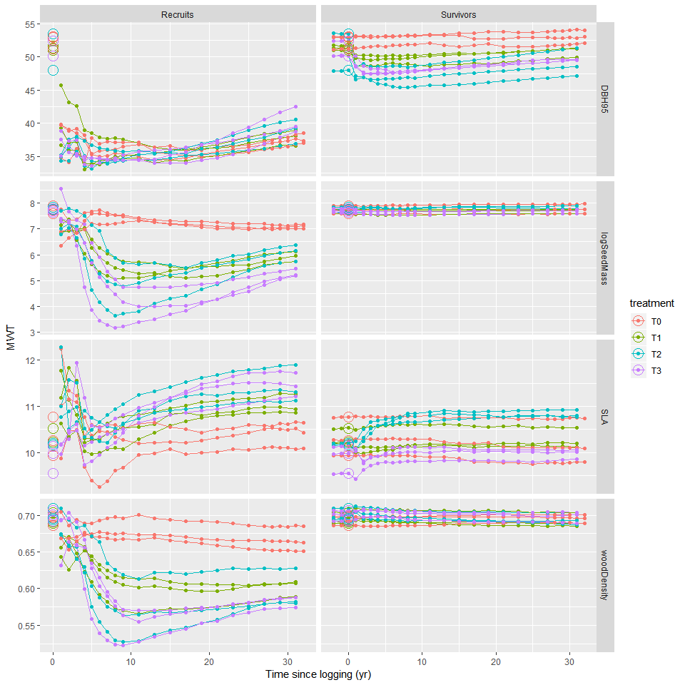
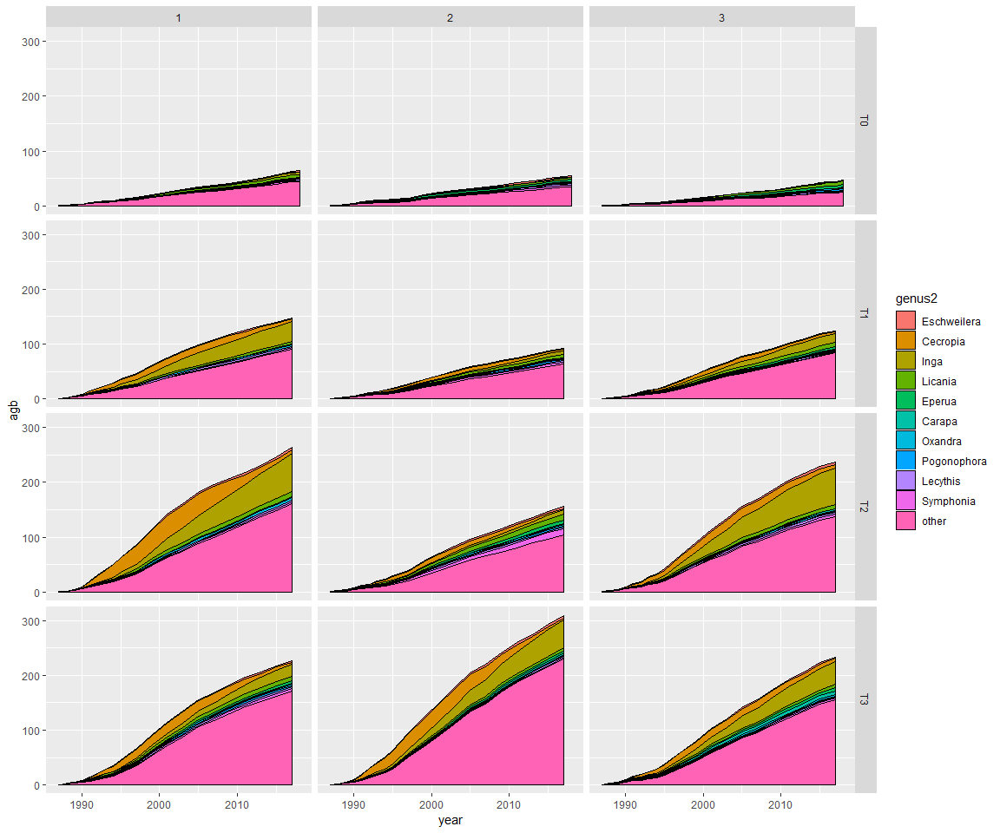
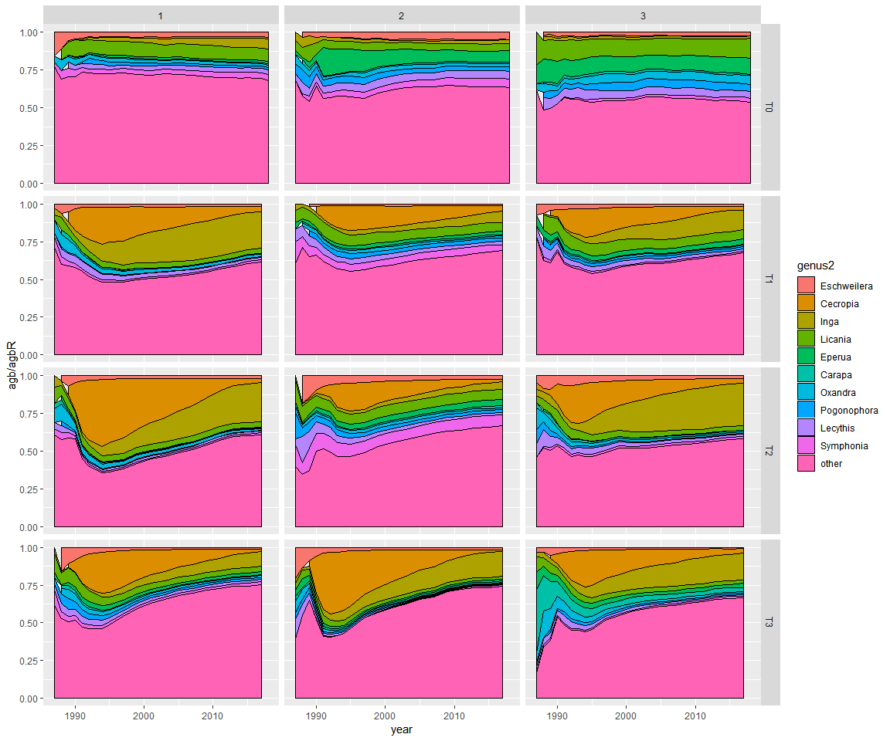
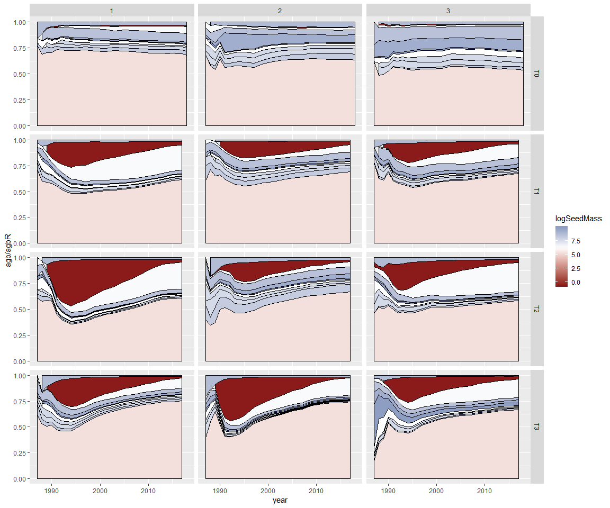
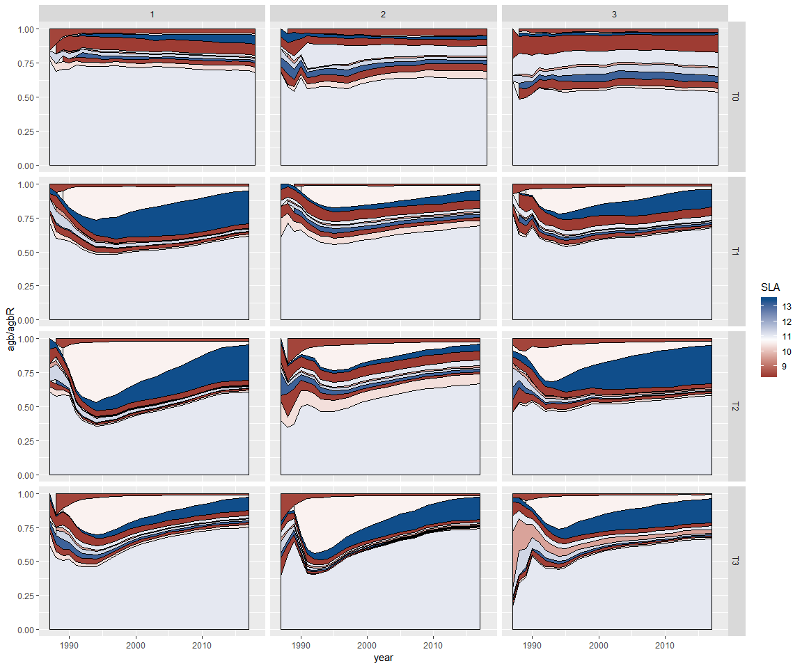
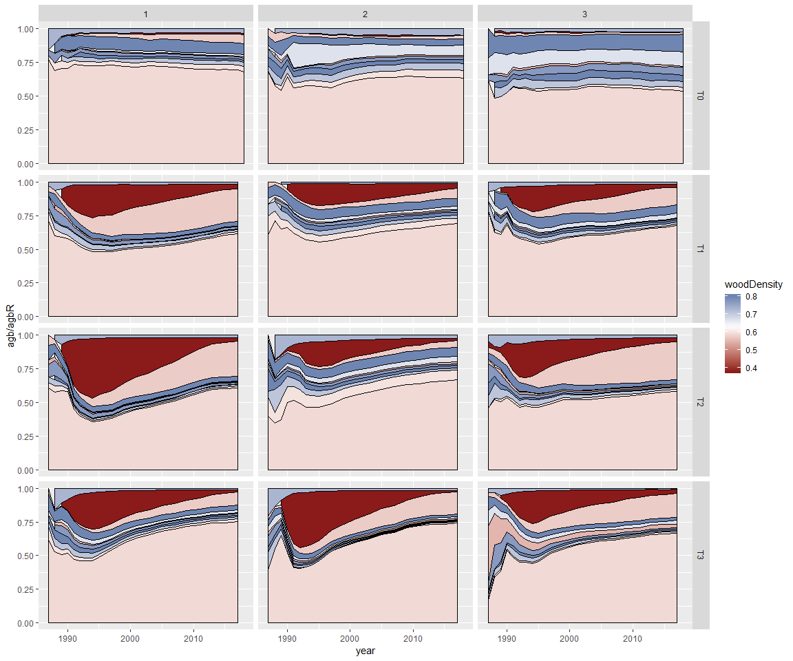

# Data visualisation

## Traits trajectory 

Traits chosen: 

- $DBH95$: DBH 95th percentile (per species) as a proxy of the stature

- $logSeedMass$: median seed mass (log-transformed) as a proxy of the dispersal strategy

- $SLA$: median specific leaf area, as a proxy of the assimilation strategy

- $WD$: median wood density (tradeoff between growth rate and mortality rate)

Cohorts: 

- Survivors, ie trees that survived logging

- Recruits, ie trees that passed the 10 cm DBH threshold after logging

Here are represented for each cohort the mean trait value, weighted by the estimated above ground biomass (AGB) of each individual.

<!-- -->

For $D$: there seems to be no effect of logging gaps on recruitment, the only effect is on survivors (direct removal of big trees + higher growth rates of big survivors): worth including in the study? 

We can exclude $D$ from the study later. 

## Recruits most common genuses and their impact on mean weighted traits {.tabset .tabset-pills}

### AGB per genus

<!-- -->

### Proportion of total AGB 

<!-- -->

### Seed mass

<!-- -->

### SLA

<!-- -->

### WD

<!-- -->

### Conclusions 

Early pioneer = cecropias (SLA 0 // seed mass -- // WD -- )

Late pioneer = ingas + miconias + tapiriras + vismias (SLA ++ // seed mass - // WD - )

- seed mass follows exactly cecropias dynamics: peaks quickly (low $tmax$, around 10 years) and recovers fast (high $\theta$)

- WD peaks quickly (low $tmax$) but stays low for long (low $\theta$)

- SLA peaks after a long time (high $tmax$) but stays low for longer (low $\theta$)
