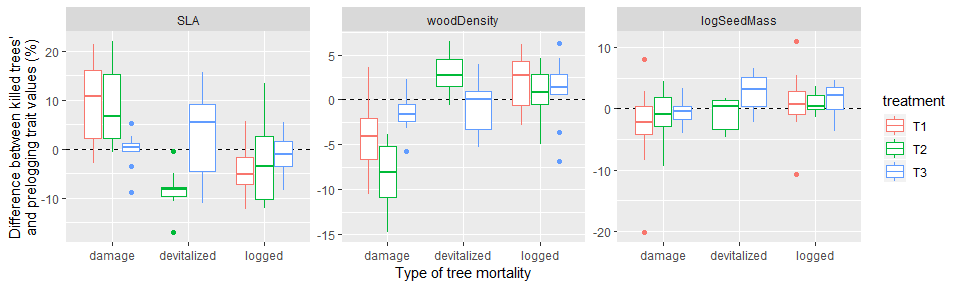
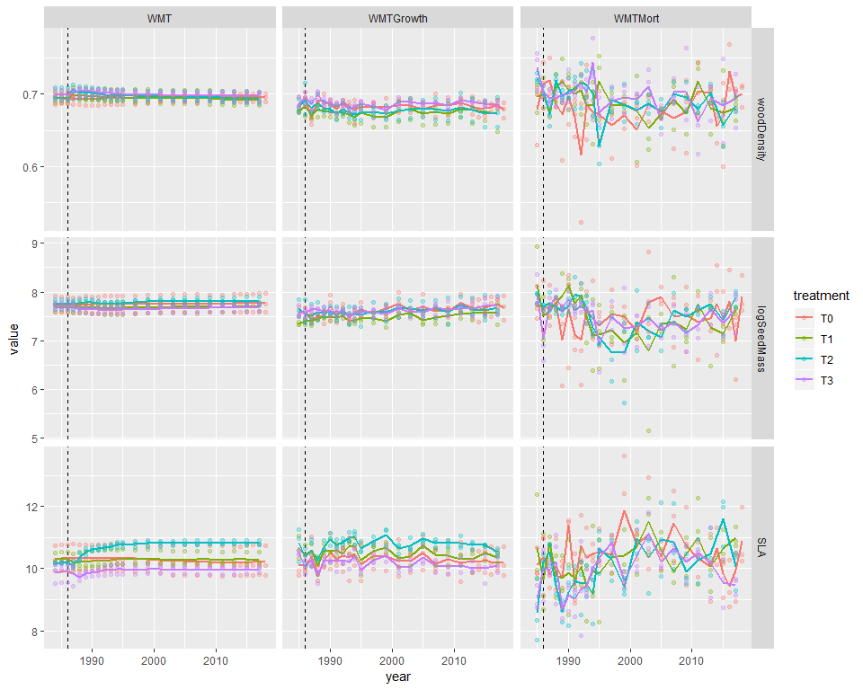
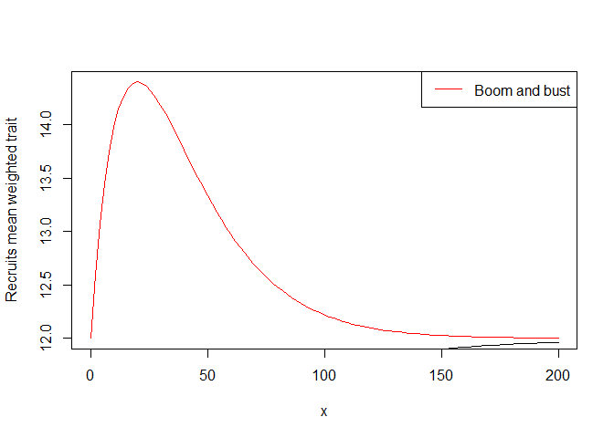
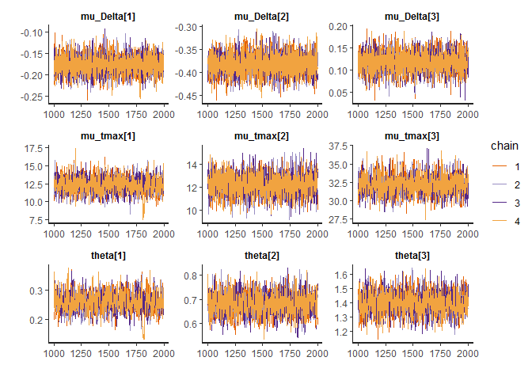
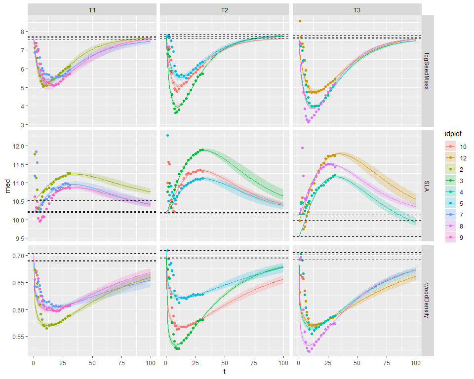
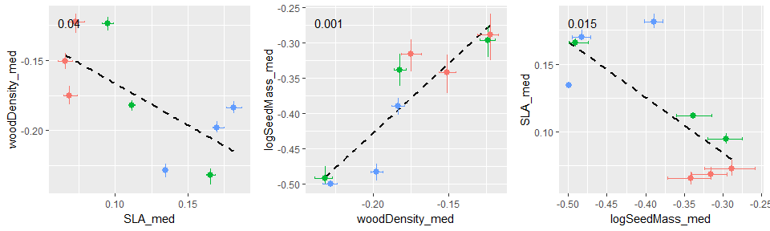
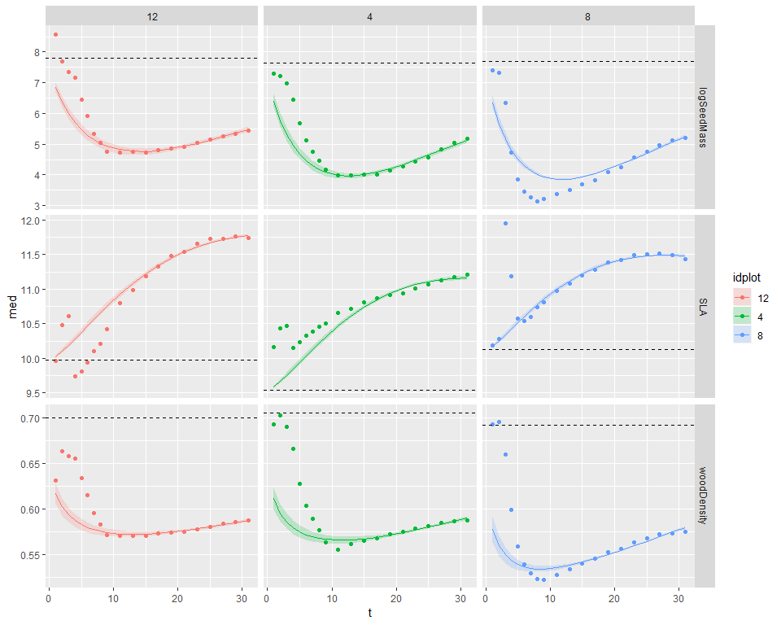

# Data visualisation

## Traits trajectory 

Traits chosen: 

- $DBH95$: DBH 95th percentile (per species) as a proxy of the stature

- $logSeedMass$: median seed mass (log-transformed) as a proxy of the dispersal strategy

- $SLA$: median specific leaf area, as a proxy of the assimilation strategy and leaf economic spectrum

- $WD$: median wood density, as a proxy of growth rate and mechanical support

Cohorts: 

- Survivors, ie trees that survived logging

- Recruits, ie trees that passed the 10 cm DBH threshold after logging

Here are represented for each cohort the mean trait value, weighted by the estimated above ground biomass (AGB) of each individual.

<!-- -->

For $D$: there seems to be no effect of logging gaps on recruitment, the only effect is on survivors (direct removal of big trees + higher growth rates of big survivors): worth including in the study? 

We can exclude $D$ from the study later. 

## Recruits most common genuses and their impact on mean weighted traits {.tabset .tabset-pills}

### AGB per genus

<!-- -->

### Proportion of total AGB 

<!-- -->

### Seed mass (log-transformed)

<!-- -->

### SLA

<!-- -->

### Wood Density

<!-- -->

### Conclusions 

Early pioneer = cecropias (SLA 0 // seed mass -- // WD -- )

Late pioneer = ingas + miconias + tapiriras + vismias (SLA ++ // seed mass - // WD - )

- seed mass follows exactly cecropias dynamics: peaks quickly (low $tmax$, around 10 years) and recovers fast (high $\theta$)

- WD peaks quickly (low $tmax$) but stays low for long (low $\theta$)

- SLA peaks after a long time (high $tmax$) but stays low for longer (low $\theta$)

## What can explain survivors' changes in WMT? (especially with SLA)

### Logging direct effect

Here we investigate the WMT of trees killed during logging operations and compare it to the community WMT. 

The categories are: 

- "logged": trees intentionally logged 

- "devitalized": big trees intentionally poisoned and girdled 

- "damage": non-intentional damage caused by logging operations (skid trails opening, tree felling) / should be random but affects smaller trees more, which have a slightly different functional composition

<!-- -->

Devitalized trees have a SLA lower than the community's, especially in T2 (that shows the highest change in terms of survivors' SLA), which could partly explain why the SLA of survivors increases sharply in treatments 2 and 3.

### Post-logging survivors dynamics

Here we analyse the WMT of the additional biomass from survivors' growth and the WMT of survivors' mortality, to see if some patterns in survivors dynamics can explain the changes in survivors' traits. 

$$WMTGrowth_{c} = \frac{\sum_{i\in I_{c-1} \cap I_{c}} (dG_{i,c} \cdot TR_i)}{\sum_{i\in I_{c-1} \cap I_{c}} (dG_{i,c})}$$

with $I_{c-1} \cap I_{c}$ the set of trees alive at both censuses $c-1$ and $c$, $dG_{i,c}$ the above-ground biomass gain of tree $i$ between census $c-1$ and $c$, and $TR_i$ the trait value of tree $i$. 

$$ WMTMort_{c} = \frac{\sum_{i\in I_{c-1} \setminus I_{c}} (agb_{i,c-1} \cdot TR_i)}{\sum_{i\in I_{c-1} \setminus I_{c}} (agb_{i,c-1})}$$
with $I_{c-1} \setminus I_{c}$ the set of trees alive at censuses $c-1$ and dead at $c$, $agb_{i,c-1}$ the above ground biomass gain of tree $i$ at census $c-1$, and $TR_i$ the trait value of tree $i$. 

<!-- -->

**Conclusions** 

The mortality of survivors during silvilcultural treatments (1987-1990) targetted trees with low SLA in treatments T2 and T3, as seen previously, but then the mortality is not different from other treatments (T0: control and T1: conventional logging). 

Survivors' growth seems to be slightly higher for high-SLA species in treatment T2, maybe because the biggest trees that were left after silvicultural treatments had higher-than-average SLA. This difference is however not very strong. 

# Recruits modelling

For each trait $k$, the mean recruits mean weighted trait (RMWT) trajectory in plot $p$ was modelled as:

$$  TR_{k,p,c} = \underbrace{TR0_{k,p}}_{\text{pre-logging value}}\left(1  +   \underbrace{\left(\Delta_{k,p} \cdot  \frac{t_c}{tmax_{k,p}} \cdot exp\left(1-\frac{t_c}{tmax_{k,p}}\right)\right)^{\theta_k}}_{\text{boom and bust pattern}} \right)$$

with 

- $c$ the census, and $t_c$ the time since logging (in years) at census $c$, 

- $TR0_{k,p}$ the pre-logging trait value of the community in plot $p$.

- $\Delta_{k,p}$ is the maximum value (relative to the final value) of the hump that follows logging and the creation of logging gaps. $\Delta_{k,p} = 0$ for control plots and $\Delta_{k,p} \sim \mathcal{N} (\mu_{\Delta k}, \sigma_{\Delta}^2)$ in logged plots, with $\mu_{\Delta k}$ and $\sigma_{\Delta}$ are respectively the mean and standard deviation of $\Delta$ for trait $k$.

- $tmax_{k,p}$ is the time when the maximum value of the hump is reached. $tmax_{k,p} = 0$ for control plots and in logged plots $tmax_{k,p} \sim \mathcal{N} (\mu m_{ k}, \sigma m^2)$ where $\mu m_{k}$ and $\sigma m$ are respectively the mean and standard deviation of $tmax$ for trait $k$.

- $\theta_k$ is a shape parameter that controls the width of the hump; when it increases, the hump is narrower.  

<!-- -->

## Calibrating recruits model

<!-- -->

## Plotting predictions {.tabset .tabset-pills}

### Treatment 1 

<!-- -->

### Treatment 2 

<!-- -->

### Treatment 3 

<!-- -->
