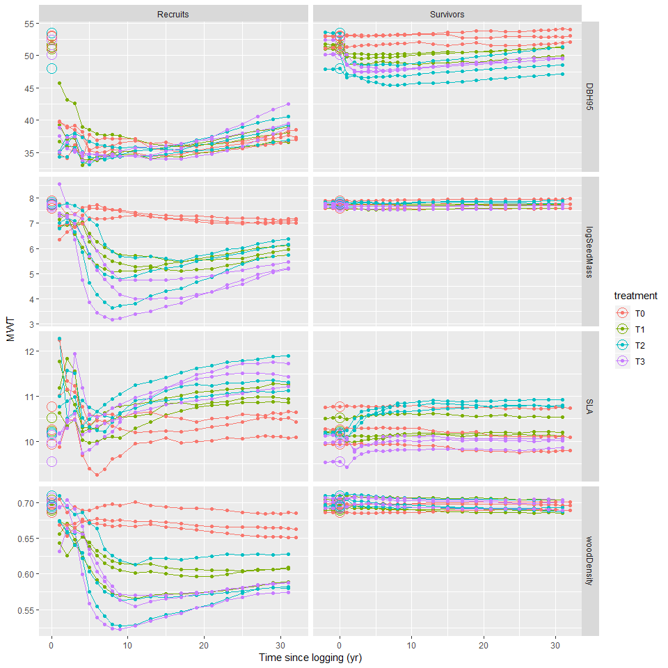

# Data visualisation

## Traits trajectory 

Traits chosen: 

- $DBH95$: DBH 95th percentile (per species) as a proxy of the stature

- $logSeedMass$: median seed mass (log-transformed) as a proxy of the dispersal strategy

- $SLA$: median specific leaf area, as a proxy of the assimilation strategy and leaf economic spectrum

- $WD$: median wood density, as a proxy of growth rate and mechanical support

Cohorts: 

- Survivors, ie trees that survived logging

- Recruits, ie trees that passed the 10 cm DBH threshold after logging

Here are represented for each cohort the mean trait value, weighted by the estimated above ground biomass (AGB) of each individual.

<!-- -->

For $D$: there seems to be no effect of logging gaps on recruitment, the only effect is on survivors (direct removal of big trees + higher growth rates of big survivors): worth including in the study? 

We can exclude $D$ from the study later. 

## Recruits most common genuses and their impact on mean weighted traits {.tabset .tabset-pills}

### AGB per genus

<!-- -->

### Proportion of total AGB 

<!-- -->

### Seed mass (log-transformed)

<!-- -->

### SLA

<!-- -->

### Wood Density

<!-- -->

### Conclusions 

Early pioneer = cecropias (SLA 0 // seed mass -- // WD -- )

Late pioneer = ingas + miconias + tapiriras + vismias (SLA ++ // seed mass - // WD - )

- seed mass follows exactly cecropias dynamics: peaks quickly (low $tmax$, around 10 years) and recovers fast (high $\theta$)

- WD peaks quickly (low $tmax$) but stays low for long (low $\theta$)

- SLA peaks after a long time (high $tmax$) but stays low for longer (low $\theta$)

## What can explain survivors' changes in WMT? (especially with SLA)

### Logging direct effect

Here we investigate the WMT of trees killed during logging operations and compare it to the community WMT. 

The categories are: 

- "logged": trees intentionally logged 

- "devitalized": big trees intentionally poisoned and girdled 

- "damage": non-intentional damage caused by logging operations (skid trails opening, tree felling) / should be random but affects smaller trees more, which have a slightly different functional composition

<!-- -->

Devitalized trees have a SLA lower than the community's, especially in T2 (that shows the highest change in terms of survivors' SLA), which could partly explain why the SLA of survivors increases sharply in treatments 2 and 3.

### Post-logging survivors dynamics

Here we analyse the WMT of the additional biomass from survivors' growth and the WMT of survivors' mortality, to see if some patterns in survivors dynamics can explain the changes in survivors' traits. 

<!-- -->
